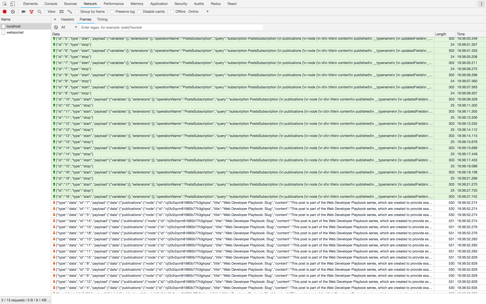

## GraphQL Yoga Server Subscription Example

### Issue Description

GraphQL-Yoga-Server subscription is not working properly. We are having subscription on blog updates, which we are initialising on app launch. But when we are navigating betweens the routes we are stopping previous subscription and starting new one (You will be able to see it in Browser's network tab). This is all happening properly, but when some update happens on blog, subscription will triggered. but now we can see subscription response from all the channels which we have stopped previosly. This makes difficult to update cached data.



### Steps to reproduce issue

#### Clone the repo
  
We have 2 separate directories for client and server ```blogrclient``` and ```blogrserver```.

#### Start Server

```
cd blogrserver
npm install // or yarn
npm run start  // or yarn start
```

#### Start Web Client

```
cd blogrclient
npm install // or yarn
npm run start  // or yarn start
```

Client will start on ```http://localhost:3000```.

You can access playground on ```http://localhost:4000```.

In order to reporduce issue you can select blog link, which will take you to blog details screen. Navigate back and click any other blog link again. You can perform this operation multiple times. You can see the ``start`` and ``stop`` websocket events in network tab. Now you need to update any of the blog using following mutation from playground.

```
mutation {
  publish(id: "blog_id") {
    id
  }
}

# Replace 'blog_id' with actual blog id.
```

Observe the network tab for subscription response, you shoud see response payload for all the previous events which we have stopped.
